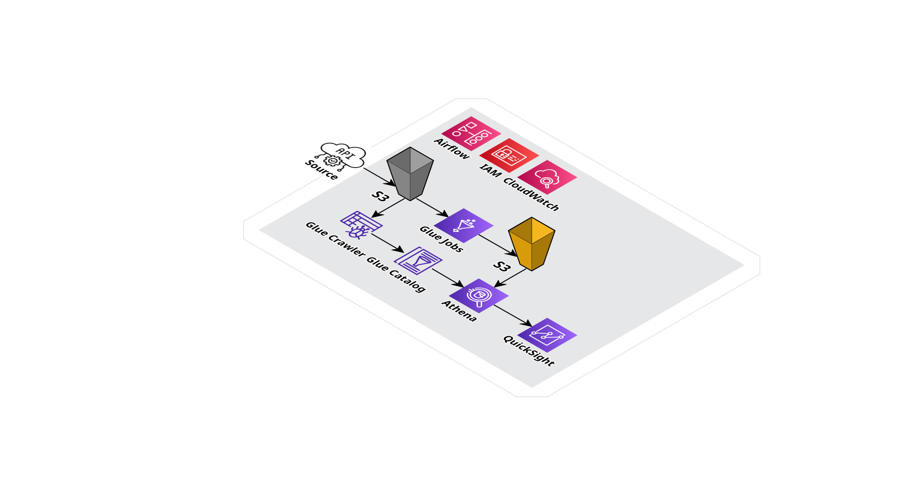
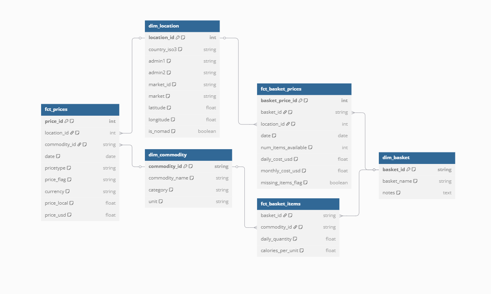
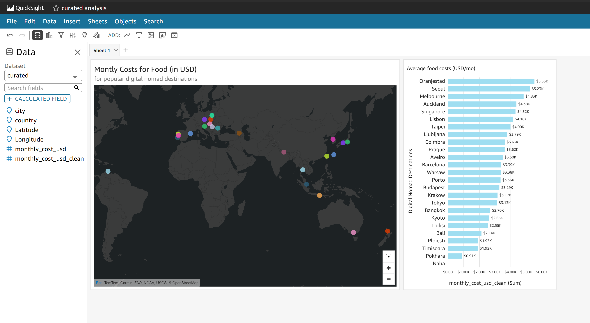

# Food Cost Estimates for Digital Nomads Destinations

## 1. Overview

> A serverless AWS-native data pipeline for estimating the monthly food cost of top digital nomad destinations using international dietary guidelines and local price data.

This data engineering pipeline estimates the monthly food cost of top digital nomad destinations. It applies international nutritional guidelines to build a realistic daily food consumption model, then calculates the cost based on local prices.

The deployment of this project is built using a modern, serverless AWS-native data stack. It covers the full pipeline from data ingestion, data modeling, to data consumption and visualization.

The final output is an interactive geospatial dashboard showing monthly food costs for each city in the final curated table.

---

## 2. Tech Stack

* **Python**

  * Used `requests` to fetch data from APIs.
  * Used `pandas` to explore the raw data and prototype transformation logic into a clean, structured format.
  * Used `pytest` to write and run unit tests validating transformation functions and data integrity.

* **Amazon S3**

  * Used `S3` as the raw source data landing and to store the final transformed tables.

* **Amazon MWAA**

  * Used AWS Managed Workflows for `Apache Airflow` to orchestrate the data pipeline via `Airflow` DAGs.

* **AWS IAM**

  * Used `IAM` to define and manage granular access roles and permissions across all AWS services involved.

* **AWS CloudWatch**

  * Used `CloudWatch` to capture pipeline logs, monitor executions, and support debugging and observability.

* **AWS Glue**

  * Used `Glue` jobs to execute transformation logic on raw data.
  * Used `Glue Crawler` and `Glue Catalog` to infer schema and register datasets for downstream query access.

* **Amazon Athena**

  * Used `Athena` to run serverless SQL queries on the transformed data in `S3`, using the Glue Catalog as the table schema.

* **Amazon QuickSight**

  * Used `QuickSight` to connect to Athena, analyze transformed data, and create interactive dashboards.

---

## 3. Architecture Diagram

---

## 4. Database Design

---

## 5. Project Development

This project was developed in three phases:

### 1. **Data Extraction & Local Prototyping**

* Wrote Python scripts to pull commodity pricing data from Numbeo API.
* Queried real-time currency exchange rates via a public API and normalized all costs to USD.
* Used `pandas` to explore, clean, and transform the data based on daily nutritional needs for an average adult, referencing international dietary guidelines.
* Defined and validated transformation logic locally using unit tests written in `pytest`.

### 2. **Cloud Pipeline Orchestration**

* Ingested raw source data into S3 bucket to serve as the data lake.
* Set up an `Airflow` DAG on AWS MWAA to orchestrate the full ETL pipeline, including:

  * Fetching the latest data
  * Executing the transformation logic
  * Writing the transformed outputs back into `S3`
* Configured `IAM` roles to manage secure access across `S3`, `Glue`, `Athena`, and `QuickSight`.
* Monitored DAG execution and pipeline health using `CloudWatch` logs.

### 3. **Data Querying & Visualization**

* Created `Glue Jobs` to run the transformation logic, and used `Glue Crawlers` and `Glue Catalog` to register the transformed dataset.
* Queried the transformed dataset using `Athena` to validate schema and inspect outputs.
* Connected `QuickSight` to `Athena`, loaded the dataset, and built a geospatial-based interactive dashboard to visualize the expected monthly cost for food across top 50 digital nomad destinations.

---

## 6. Key Learnings

### Why Athena over Redshift

Although `Redshift` is powerful for complex, high-performance analytical workflows, I chose `Athena` + `S3` because:

* It’s fully serverless, no resource provisioning or tuning needed.
* It integrates well with `Glue` ETL workflows.
* Query volume and dataset size were modest, so the pay-per-query model made more economical sense.
* It's important to pick the right tools for the scale and nature of the data and the project-at-hand.

### Pipeline Iteration Workflow

Because the business/transformation logic required iterations, I found it much more efficient to:

* Prototype and test locally using `Pandas` + `PyTest`.
* Only move to Glue once the logic was proven to be solid locally.

This is a best practice in data engineering: isolate and iterate logic locally, then scale in the cloud.

### IAM & Airflow Role Propagation

Setting up `IAM` permissions across a distributed serverless stack was a good practice opportunity:

* `MWAA` requires both execution roles for the `Airflow` environment and task-level roles for DAGs.
* Explicitly define policies to allow role assumptions across services.
* Use least-privilege best practices without blocking access to critical services such as `S3` writes or `Glue` job triggers.
* Debug permission errors using CloudWatch logs and the `IAM` policy simulator.

### Geospatial Visualization Limits in QuickSight

`QuickSight`’s geospatial support is limited compared to `Looker` or `Power BI`:

* Only one geospatial field is allowed per 'points on map' visual, requiring careful preprocessing.
* Unlike other tools, `QuickSight` does not support custom text labels directly on geospatial visuals.
* Understanding these limits early on helps in setting accurate stakeholder expectations.

---

## 7. Dashboard Screenshot

---

## 8. About Me / Contact

* [LinkedIn](https://www.linkedin.com/in/royma/)
* [roy.ma9@gmail.com](mailto:roy.ma9@gmail.com)
